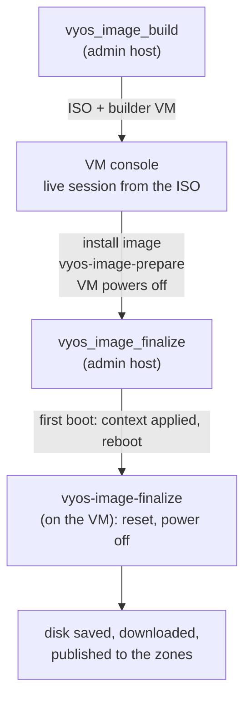

# VyOS image for OpenNebula

This document describes how claugine-cli builds a VyOS Stream router image
for OpenNebula and how VMs created from that image configure themselves.

- [Result](#result)
- [How it works](#how-it-works)
- [Before you start](#before-you-start)
- [Files](#files)
- [Phase 1: `vyos_image_build`](#phase-1-vyos_image_build)
- [Manual steps on the console](#manual-steps-on-the-console)
- [Phase 2: `vyos_image_finalize`](#phase-2-vyos_image_finalize)
- [VMs created from the image](#vms-created-from-the-image)
- [Publishing to another installation](#publishing-to-another-installation)
- [Existing images with the same name](#existing-images-with-the-same-name)
- [Cleanup](#cleanup)
- [Troubleshooting](#troubleshooting)

## Result

- An OS image `VyOS Router <version>` (qcow2) in the images datastore of every
  zone of the current installation (or of the zones you choose).
- A local copy of the image, `vyos-<version>.qcow2`, in `DIR_VYOS_REPO`.
- A VM created from the image applies the OpenNebula context on its first boot:
  addresses, gateway, routes, MTU, host name, user, password, ssh key, time zone.

## How it works

VyOS publishes no cloud image for OpenNebula, and `install image` is
interactive. The build is split into two automated phases with three commands
on the VM console in between.



| Step | Where | Who | What happens |
|---|---|---|---|
| 1 | admin host | `vyos_image_build` | download the latest VyOS Stream ISO, add the claugine files, upload the ISO, create the builder VM |
| 2 | VM console | you | `install image`, then `vyos-image-prepare`: grub and scripts written to the installed disk, VM powers off |
| 3 | admin host | `vyos_image_finalize` | detach the ISO, boot the installed system, wait for the first run |
| 4 | builder VM | `vyos-image-finalize` | reset the configuration to the image defaults, re-enable the first run, power off |
| 5 | admin host | `vyos_image_finalize` | save the disk as an image, download it, publish it to the zones |

## Before you start

**Workstation** - the tools from `ADMIN_TOOLS` (checked at start-up), in
particular `curl`, `xorriso`, `rsync`, `jq`, `ssh`.

**Platform data** (`data/claugine-cli_*.sh`, see `data/claugine-cli_SAMPLE.sh`):

| Variable | Meaning |
|---|---|
| `DIR_VYOS_REPO` | local directory for the ISOs and the image, must exist |
| `URL_VYOS_REPO[zone VIP]` | optional: URL of `DIR_VYOS_REPO` reachable from the zone FE; when set, the FE downloads files by URL instead of an rsync copy from the workstation |
| `IMAGES_DS_LIST[zone VIP]` | images datastore per zone, the first one is used by default |

**Internal data** (`internal/claugine-cli_data-vyos.sh`) - defaults, change
only if needed:

| Variable | Default | Meaning |
|---|---|---|
| `VYOS_STREAM_PAGE` | `https://vyos.net/get/stream/` | page with the latest Stream ISO link |
| `VYOS_IMAGE_NAME` | `VyOS Router` | image name prefix, the version is appended |
| `VYOS_BUILDER_PREFIX` | `vyos-builder-` | builder VM name prefix |
| `VYOS_BUILDER_DISK` | `2` | builder VM disk, GB - the size of the image |
| `VYOS_EMPTY_IMAGE` | `Empty disk` | image used for the builder VM disk, resized to `VYOS_BUILDER_DISK` |
| `VYOS_DEFAULT_PASSWORD` | | password of user `vyos` in the image |
| `VYOS_WAIT_LIMIT` | `900` | seconds to wait for a boot or a power off |
| `VYOS_ISO_FILES`, `VYOS_ISO_FILES_PATH`, `DIR_VYOS_ISO_FILES` | | files added to the ISO, see [Files](#files) |

**OpenNebula**

- the installation loaded: `fe_data_refresh fe=IP`;
- an image named `VYOS_EMPTY_IMAGE` on the zone FE;
- a virtual network for the builder VM with a free address;
- that address must be reachable by ssh from the workstation;
- ssh key pair `${SSH_KEYF}` / `${SSH_KEYF}.pub` on the workstation - the
  public key is put into the builder VM context and used in phase 2.

## Files

All files live in `templates/vyos/`. `iso_get_vyos` adds them to the ISO under
`/claugine/`; in the live session the ISO is mounted at
`/usr/lib/live/mount/medium`.

| File | Runs | Purpose |
|---|---|---|
| `grub.cfg` | - | boot menu of the installed system: one entry, `net.ifnames=0`; `${VYOS_VER}` is replaced by the installed version |
| `vyos-image-prepare` | manually, live session | writes `grub.cfg` and the scripts below to the installed disk, powers off |
| `vyos-postconfig-bootup.script` | every boot (VyOS standard hook) | mounts the context CD, runs the first run script once, runs context scripts, creates the flag `/opt/vyatta/etc/init.flag`, reboots after the first run |
| `vyos-first-run.script` | first boot only | applies the context: interfaces, routes, host name, user, password, ssh key, time zone; renamed to `*.disabled` afterwards |
| `vyos-image-finalize` | by `vyos_image_finalize` over ssh | resets the builder configuration, re-enables the first run, removes host keys, machine-id and history, powers off |

On the installed system the scripts are in `/config/scripts/`
(`/opt/vyatta/etc/config/scripts/`).

## Phase 1: `vyos_image_build`

```bash
source bin/claugine-cli.sh
fe_data_refresh fe=10.71.101.30
vyos_image_build zone_id=0 cluster=default vnet=core_dc1 addr=10.71.101.223 gw=10.71.101.254
```

| Parameter | Meaning |
|---|---|
| `zone_id=N` | zone where the builder VM runs |
| `cluster=ID\|NAME` | cluster of the builder VM; `VYOS_EMPTY_IMAGE`, the ISO datastore and `vnet` must belong to it |
| `vnet=STRING` | builder VM network, name or id |
| `addr=IP` | builder VM address, reachable by ssh from the workstation |
| `gw=IP`, `dns=IP` | optional |
| `url=URL` | optional: ISO URL, default - the latest from `VYOS_STREAM_PAGE` |
| `empty_image=STRING` | optional: default `VYOS_EMPTY_IMAGE` |
| `ds=ID` | optional: default - the first of `IMAGES_DS_LIST` for the zone VIP |

What it does:

1. `iso_get_vyos` finds the latest Stream ISO, downloads it to `DIR_VYOS_REPO`
   (cached, partial downloads resumed) and builds
   `vyos-<version>-generic-amd64-autoinstall.iso` with the files from
   `templates/vyos/` in `/claugine/`. The ISO stays bootable.
2. Stops if the builder VM `vyos-builder-<version>` already exists.
3. Uploads the ISO as CDROM image `VyOS Router <version> ISO` (prefix `sd`).
   An existing image with this name is handled as described in
   [Existing images](#existing-images-with-the-same-name).
4. Creates the builder VM `vyos-builder-<version>` in `cluster`: 1 CPU, 1 GB RAM,
   disk 0 - `VYOS_EMPTY_IMAGE` resized to `VYOS_BUILDER_DISK` GB, disk 1 -
   the ISO, boot order ISO first, NIC with `addr`, user `vyos` with the
   default password and your public key in the context, no hourly autostart.
5. Prints the manual steps.

## Manual steps on the console

Open the VM console in FireEdge (VNC):

1. Log in as `vyos` / `vyos` (live session defaults).
2. Run `install image` and accept the defaults; answer **no** to the reboot
   question.
3. Run
   ```
   sudo bash /usr/lib/live/mount/medium/claugine/vyos-image-prepare
   ```
   It finds the installed system (partition labeled `persistence`), saves the
   original `grub.cfg` as `grub.cfg.original`, writes the claugine `grub.cfg`,
   copies the scripts to `/config/scripts/` and powers the VM off after 10
   seconds.

## Phase 2: `vyos_image_finalize`

Run it when the builder VM is in state POWEROFF:

```bash
vyos_image_finalize zone_id=0 vm=vyos-builder-2026.03
```

| Parameter | Meaning |
|---|---|
| `zone_id=N` | zone of the builder VM |
| `vm=STRING` | builder VM name or id |
| `ip=IP` | optional: builder VM address, default - the first NIC |
| `name=STRING` | optional: image name, default `VyOS Router <version>` |
| `zones=LIST\|ALL` | optional: zones to publish the image to, default - all zones of the installation |
| `ds=ID` | optional: default - the first of `IMAGES_DS_LIST` for each zone VIP |
| `limit=N` | optional: seconds for a boot or a power off, default `VYOS_WAIT_LIMIT` |
| `confirm=yes` | skip the confirmation |

What it does:

1. Detaches the ISO and waits until it is gone. From now on the only CD-ROM
   is the context CD, which `vyos-postconfig-bootup.script` mounts as `/dev/sr0`.
2. Boots the installed system. On this first boot the first run script applies
   the context (address, your ssh key), creates the flag and reboots.
3. Waits until ssh as `vyos` works **and** the flag is older than the current
   boot - that is, the first run reboot is over.
4. Starts `vyos-image-finalize` on the VM, detached from the ssh session
   (the session drops when the interfaces are removed). The script:
   - deletes `interfaces ethernet`, `protocols static`, `service` and the
     ssh keys of user `vyos`;
   - sets the default password, host name `vyos-router`, ssh on port 22,
     `ctrl-alt-delete ignore`, `reboot-on-panic`;
   - restores `vyos-first-run.script` and removes the flag, so the next VM
     created from the image runs its first run;
   - removes ssh host keys, the config archive, `machine-id` and shell
     history;
   - powers off. Log while it runs: `/tmp/vyos-image-finalize.log`.
5. Saves the VM disk as a temporary image and waits until it is READY.
6. Downloads it to `DIR_VYOS_REPO/vyos-<version>.qcow2`.
7. Publishes it with `image_publish` to every zone in `zones` as OS image
   `VyOS Router <version>`: by URL from `URL_VYOS_REPO[zone VIP]` when
   defined, by rsync otherwise.
8. Deletes the temporary image.

## VMs created from the image

On the first boot `vyos-first-run.script` reads the OpenNebula context:

| Context variable | Default | Effect |
|---|---|---|
| `ETHn_MAC` | | the interface is configured only if present |
| `ETHn_IP`, `ETHn_MASK` | mask `255.255.255.0` | interface address |
| `ETHn_GATEWAY` | | default route via this gateway |
| `ETHn_ROUTES` | | `NET via GW, NET via GW` - static routes |
| `ETHn_METRIC` | `100` | distance of the routes of this interface |
| `ETHn_MTU` | `1500` | MTU; IPv6 link-local and forwarding disabled |
| `HOSTNAME` | `vyos-router` | host name |
| `USERNAME` | `vyos` | another name creates that user and disables `vyos` |
| `CRYPTED_PASSWORD_BASE64` | default password | base64 of the password hash |
| `SSH_PUBLIC_KEY` | | key of the user; ssh password login is disabled when set |
| `SSH_PORT` | `22` | ssh port |
| `TIMEZONE` | `Asia/Almaty` | time zone |

`vyos-postconfig-bootup.script` also understands:

| Context variable | Effect |
|---|---|
| `FIRSTRUN_SCRIPT_DISABLE=yes` | skip the first run, keep the image defaults |
| `CONTEXT_SCRIPTS_DISABLE=yes` | never run `*.sh` from the context CD |
| `CONTEXT_SCRIPTS_ENFORCE=yes` | run `*.sh` from the context CD on every boot, not only the first |

After the first run the VM reboots once; the flag file
`/opt/vyatta/etc/init.flag` holds the initialization date.

> The default password is published with the scripts. Always set
> `SSH_PUBLIC_KEY` or `CRYPTED_PASSWORD_BASE64` in the VM template.

`vm_create` fills these variables from its parameters (`vnetN`, `addrN`,
`gwN`, `routesN`, `metricN`, `mtuN`, `hostname`, `user`, `pswd`, `key`, `tz`).

## Publishing to another installation

Commands work inside the installation loaded by `fe_data_refresh`. To put
the same image into another OpenNebula installation, load it and publish the
local copy - no second builder VM is needed:

```bash
fe_data_refresh data=one_dc3 fe=10.73.101.30      # another installation
image_publish file=~/repo/vyos/vyos-2026.03.qcow2 name="VyOS Router 2026.03" \
  repo=URL_VYOS_REPO type=OS format=qcow2           # zones=ALL by default
zone_data=claugine_zone                             # back to the first installation
```

## Existing images with the same name

`image_upload` frees the name before it creates a new image (`image_archive`):

- the image is used by no VM - it is deleted, and the upload waits until it
  is gone;
- the image is used by VMs - it is renamed to `NAME (YYYY-MM-DD)`, the date of
  its registration (`NAME (YYYY-MM-DD HH-MM)` if that name is taken too).

VM templates that refer to the image by ID lose it when it is deleted;
templates that refer to it by name get the new image.

## Cleanup

`vyos_image_finalize` leaves for you to decide:

- the builder VM `vyos-builder-<version>`, powered off - terminate it;
- the ISO image `VyOS Router <version> ISO` on the zone FE;
- in `DIR_VYOS_REPO`: the original ISO, the customized ISO and
  `vyos-<version>.qcow2`.

## Troubleshooting

`vyos_image_build` return codes:

| Code | Meaning |
|---|---|
| 1 | installation not loaded (`fe_data_refresh`) or `zone_id` not in it |
| 2 | `cluster`, `vnet` or `addr` not set, or `${SSH_KEYF}.pub` missing |
| 3 | ISO not found, not downloaded or not customized |
| 4 | builder VM already exists - terminate it or finish it with phase 2 |
| 5 | ISO upload failed |
| 6 | VM creation failed: cluster, image or network not found or not unique, address leased |

`vyos_image_finalize` return codes:

| Code | Meaning |
|---|---|
| 1 | installation not loaded, `zone_id` or `zones` not in it, or not confirmed |
| 2 | builder VM not found |
| 3 | VM not powered off, or no IP - finish the manual steps first |
| 4 | ISO not detached |
| 5 | VM did not start |
| 6 | no ssh after the first run - check the VM console: context, address, key |
| 7 | `vyos-image-finalize` did not power the VM off - see `/tmp/vyos-image-finalize.log` on the VM |
| 8 | disk not saved as an image |
| 9 | image download failed |
| 10 | publishing failed - the image is in `DIR_VYOS_REPO`, rerun `image_publish` for the zones left |

Test scripts: `tests/vyos-image-build.sh` and
`tests/vyos-image-finalize.sh vyos-builder-<version>`, data in
`tests/claugine-cli_TEST.sh`.
