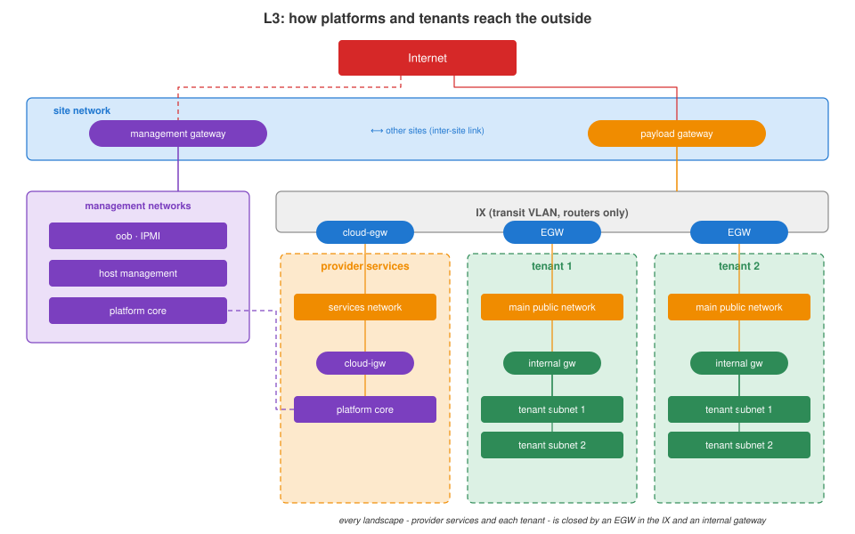

# Network

[Platform](../platform/README.md) › network

Network functions and services of the platform and the claugine commands
that build and run them.

The data network itself (switches, uplinks, routing to the outside) is
designed and run outside the cloud project. This document covers what the
platforms use; the services built on it have their own documents:

| service | document |
|---|---|
| EVPN fabric - tenant overlays | [evpn.md](evpn.md) |
| exchange network to the Internet | [ix-internet.md](ix-internet.md) |
| exchange network to a corporate network | [ix-corpnet.md](ix-corpnet.md) |
| L2-over-L3 channels | [l2-over-l3.md](l2-over-l3.md) |
| VyOS router image - route reflectors, EGWs, L2-over-L3 legs | [vyos-image.md](vyos-image.md) |

## L3 layout

- **Site network** - provided by the data network, connects the site to the
  Internet and to the other sites.
- **Management gateway** - routes the management networks: oob, host
  management, platform core.
- **Payload gateway** - connects the exchange network (IX) to the outside.
- **Every landscape is closed the same way** - by an EGW in the IX and an
  internal gateway behind it. Tenants have their EGW and internal gateway;
  the provider's own published services have `cloud-egw` (services network
  to the IX) and `cloud-igw` (platform core to the services network).

## Fabrics

| fabric | carries |
|---|---|
| data | everything except storage: platform, services, transit, VXLAN transport |
| storage | hosts ↔ storage systems |

Both fabrics have no single point of failure; the platform tolerates a
network outage of up to one second.

## Host network stack

Every host has two dual-port 25G NICs and an out-of-band port:

| LAG | ports | fabric | segments |
|---|---|---|---|
| lag1 | NIC1 port 1 + NIC1 port 2 | data | host management, platform core, services, exchange networks, VXLAN transport |
| lag2 | NIC2 port 1 + NIC2 port 2 | storage | NFS, iSCSI |

LACP, 802.1Q, MTU 9000. VM networks are Linux bridges created by OpenNebula
per network: VLAN on the management platform, VXLAN on the payload platform.

## Segments

| kind | segment | purpose |
|---|---|---|
| internal | oob | IPMI of all servers |
| internal | host management | host OS management |
| internal | platform core | services that run the platform |
| routed | services | services published to users: FE end points, DNS, ... |
| routed | tenant main network | delegated to one tenant, /31 and up |
| transit | exchange networks | IX to the Internet, IX to a corporate network |
| isolated | VXLAN transport | carries the EVPN overlay between payload hosts |
| isolated | storage | NFS / iSCSI |
| transit | s2s transport | L3 between the legs of L2-over-L3 channels |
| overlay | tenant subnets | created by tenants, VXLAN/EVPN, any addressing |

## Time

Two NTP servers per site, provided by the data network, synchronised within
and between sites from trusted sources.
