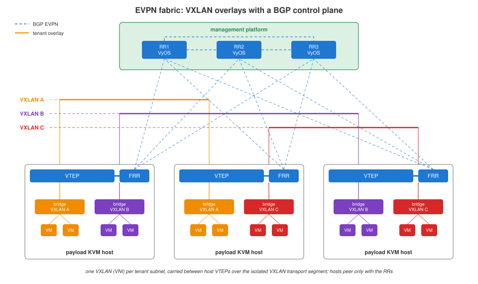

# EVPN fabric

[Platform](../platform/README.md) › [Network](README.md) › EVPN fabric

Tenant L2 segments on the payload platform are VXLAN overlays with an EVPN
control plane.

## Design

- **Data plane** - every tenant subnet is one VXLAN with a unique VNI. On a
  host, VMs of one VXLAN share a Linux bridge, created when the first VM of
  that network starts on the host and removed after the last one. Between
  hosts, frames are encapsulated at the host VTEP and carried over the
  isolated VXLAN transport segment, which has no L3 path outside.
- **Control plane** - BGP EVPN, FRR on every payload host.
- **Route reflectors** - three VyOS VMs on the management platform:
  - receive from every host the MAC/IP of every VM in every VXLAN;
  - distribute the full table to all hosts;
  - keep their tables in sync.
- **Hosts** peer only with the three route reflectors; adding or removing a
  host changes nothing on other hosts or on the RRs.

## OpenNebula settings

The VTEP of an OpenNebula VXLAN network must be the host's local IP,
`VXLAN_TEP = local_ip`, so that BGP EVPN, not multicast, learns the
endpoints. It has to be set on:

| where | claugine |
|---|---|
| every VXLAN VNet | `evpn_vtep_vnet_get`, `evpn_vtep_vnet_set` |
| the VNet template tenants create networks from | the same commands |
| the OpenNebula VXLAN driver on the FE nodes | `evpn_vtep_vnm_patch`, `evpn_vtep_vnm_unpatch` |
| running VM NICs | `evpn_vtep_nic_get` - shows NICs still on `dev` |

The route reflectors run the VyOS image built by `vyos_image_build` /
`vyos_image_finalize`, see [VyOS image](vyos-image.md).
