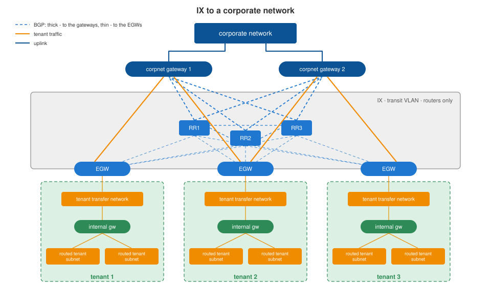

# Exchange network to a corporate network

[Platform](../platform/README.md) › [Network](README.md) › IX to a corporate network

Connects tenant landscapes to a corporate network instead of, or in addition
to, the Internet.

## Design

The same model as the [Internet exchange network](ix-internet.md):

- a dedicated transit VLAN with routers only;
- corporate network gateways on the data network side;
- the tenant's **EGW** - a provider-controlled VyOS VM on the payload
  platform - with its outside leg in this exchange network and its inside
  leg in the tenant's landscape;
- routes exchanged over BGP through the route reflectors.

## Open points

Not described in the reference design yet - to be completed:

- addressing: corporate address plan vs. tenant subnets, overlaps and NAT;
- whether one EGW serves both exchange networks or a tenant gets one per
  exchange network;
- route policy: which tenant subnets are announced to the corporate network
  and which corporate routes the tenant receives;
- bandwidth and filtering rules on the EGW for this connection.
