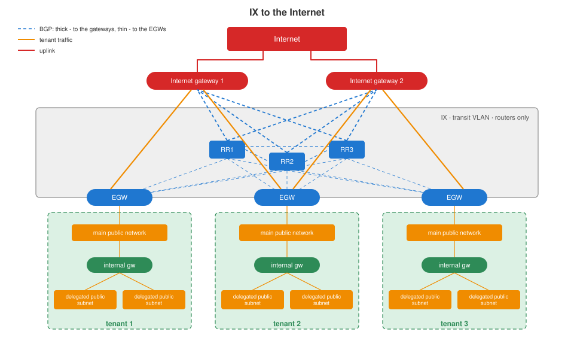

# Exchange network to the Internet

[Platform](../platform/README.md) › [Network](README.md) › IX to the Internet

Connects tenant landscapes to the Internet with public addressing, per
tenant bandwidth and address control.

## Design

The exchange network (IX) is a dedicated transit VLAN. Only routers are
connected to it, they talk only to each other, nothing outside the VLAN can
reach their addresses, and only permitted transit traffic passes.

| router | where | role |
|---|---|---|
| Internet gateways | data network | exchange traffic with the Internet; announce the default route; receive and aggregate the tenants' public subnets |
| route reflectors | management platform, 3 VyOS VMs | receive the tenants' public subnets from the EGWs and the routes of the Internet gateways; send the full table to all BGP peers |
| EGW - tenant external gateway | payload platform, one VyOS VM per tenant | announces the tenant's public subnets: connected and statically routed |

## Tenant connection

- **EGW** - controlled by the provider, not reachable by the tenant:
  - outside leg in the IX: bandwidth is shaped here to the ordered rate
    (from 10 Mbit/s, in 10 Mbit/s steps; traffic inside the provider network
    is not limited);
  - inside leg in the tenant's **main public network**, /31 minimum: one
    address is the tenant's default gateway on the EGW;
  - lets in and out only the tenant's public addresses - the main public
    network and additional public subnets;
  - drops addresses not routed in the Internet (RFC 1122, 1918, 3927, 5737,
    6598 and the other special-purpose blocks).
- **Internal gateway** - the tenant's router between its overlays and the
  main public network: OpenNebula Virtual Router, a VyOS VM, or the tenant's
  own appliance; does source NAT for private subnets.

## Operations

- EGWs and route reflectors run the VyOS image from `vyos_image_build` /
  `vyos_image_finalize` ([VyOS image](vyos-image.md)); EGW VMs are created with
  `vm_create`, their IX and tenant addresses with `vnet_*`.
