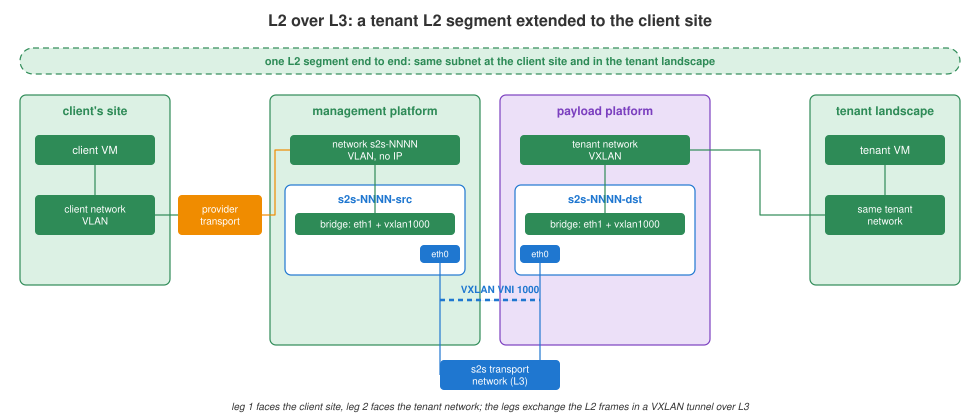

# L2-over-L3 channels

[Platform](../platform/README.md) › [Network](README.md) › L2-over-L3 channels

Extend a tenant L2 segment to a client site over an L3 network: client
systems and tenant VMs share one broadcast domain and one subnet.

## Design

A channel `s2s-NNNN` has two legs - provider-controlled VMs, one per
platform:

| | leg 1 `s2s-NNNN-src` | leg 2 `s2s-NNNN-dst` |
|---|---|---|
| platform | management | payload |
| faces | the client site | the tenant network |
| `eth1` | network `s2s-NNNN`: a VLAN from the provider transport network to the client site, no IP | the tenant's VXLAN network |
| `eth0` | s2s transport network, an address of leg 1 | s2s transport network, an address of leg 2 |
| inside | Linux bridge `eth1` + `vxlan1000` | Linux bridge `eth1` + `vxlan1000` |

- The legs exchange the client's Ethernet frames in a VXLAN tunnel (one VNI
  per channel, `1000` in the example) over the s2s transport network.
- Neither leg has an address in the client segment: they only bridge.
- The tenant network is an ordinary tenant VXLAN network on the EVPN fabric;
  leg 2 is just one more VM in it.

## Open points

To be completed in the reference design:

- MTU of the extended segment: VXLAN adds 50 bytes on the s2s transport
  network;
- redundancy of the legs;
- the image of the legs (VyOS or a plain Linux VM) and how channels are
  created - a candidate for claugine commands.
