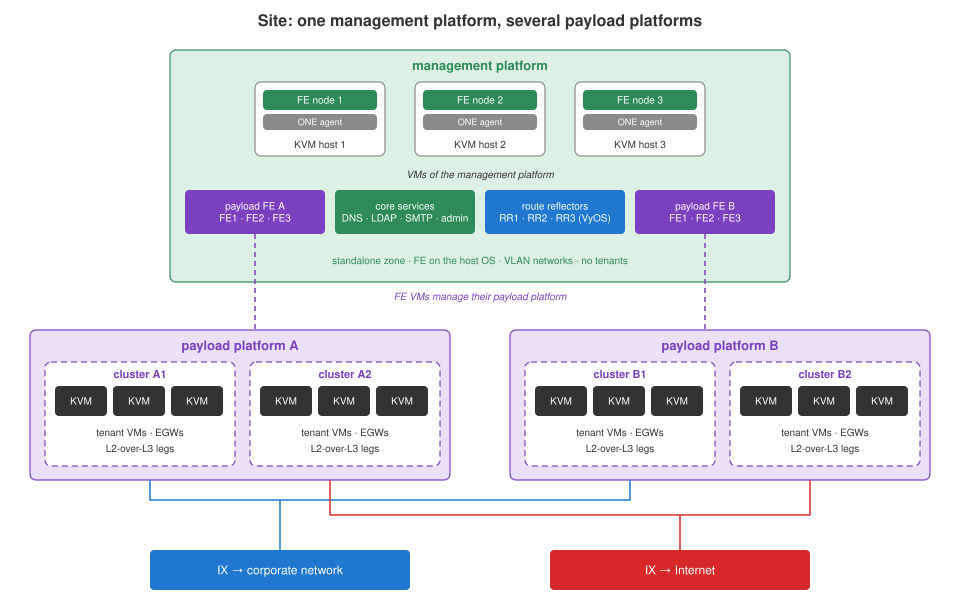

# Platform

The target platform of claugine: an IaaS cloud on
[OpenNebula](https://opennebula.io) Enterprise with KVM hosts and an
EVPN/VXLAN overlay. This is the cover document of the platform; network
functions and services are described in [network](../network/README.md).

| Document | Content |
|---|---|
| [management.md](management.md) | management platform: core services of a site |
| [payload.md](payload.md) | payload platform: tenants, IaaS service, isolation |
| [../network/](../network/README.md) | network: fabrics, segments, EVPN, exchange networks, L2-over-L3, VyOS image |

The documents describe the design; addresses, names and sizes of a real site
live in your data set ([data](../data/README.md)).

## Sites

The cloud consists of one or more **sites**. Every site is fully autonomous:
own hardware, uplinks and control plane; it keeps working when cut off from
the other sites. Sites are connected by a direct link that carries control
plane traffic (federation sync, remote management), tenant traffic between
sites (L3), backup synchronisation and storage replication.

## Platforms

On every site management and payload are separated completely: each is a
separate OpenNebula installation - a **platform** in claugine terms. A site
has one management platform and one or more payload platforms; every payload
platform has its own FE, its own clusters and its own exchange network
connections.



| | management platform | payload platform |
|---|---|---|
| purpose | core services of the site | tenant workloads |
| per site | one | one or more |
| zones | one, standalone | one per site, the zones of one payload platform federated across sites |
| FE | 3 FE nodes on the host OS | 3 VMs on the management platform of the site |
| hosts | three hosts | clusters of identical hosts, N+1 |
| tenants | none: no shared group, no EVPN fabric | groups, quotas, ACLs, shared group |
| details | [management.md](management.md) | [payload.md](payload.md) |

## Control plane

Every platform zone has its own FE:

- **FE** - three FE nodes in a Raft cluster; the leader owns the **VIP**, all
  communication goes through the VIP; on leader failure the other two elect a
  new one and the VIP moves.
- **ONE agent** - on every host, talks only to the FE of its zone.
- **End points** - FireEdge web UI and REST API, XML-RPC API, OneGate,
  published through an HTTPS reverse proxy; clients: web UI, CLI, Terraform,
  language bindings, the OneGate agent in VMs.

Losing the control plane does not stop running VMs; an FE is restored from
its backup (`fe_backup`).

## Hosts

- **OS** - Ubuntu Server 26.04 LTS with kernel 7: OCFS2 is in the kernel,
  and live migration runs without any interruption for the VM.
- **User `oneadmin`** - UID 9987 on every host and FE node, used by all FE
  services.
- **Fault domain** - one host. All hosts of a cluster are configured the same
  and are interchangeable; VMs of a failed host restart on the others.
- **Connection** - two LAGs, no single point of failure, see
  [network](../network/README.md#host-network-stack).

## Storage

The platform works with any storage:

| storage | how OpenNebula uses it |
|---|---|
| NFS (preferred) | datastores on NFS exports mounted on the hosts |
| iSCSI / FC SAN | OCFS2 shared file system on the LUNs, or LVM datastores (OpenNebula 7.4) |
| local disks / DAS | local datastores |

Datastores of a zone:

| datastore | content | per zone |
|---|---|---|
| SYSTEM | disks of running VMs | per cluster |
| IMAGE | images VMs are created from | one or more per zone; claugine finds them and their clusters |
| FILE | files passed to VMs | exactly one |
| BACKUP | VM backups | exactly one |

Every cluster has its own volumes. The FILE and BACKUP datastores and the
VNet template exist once per zone, so claugine finds their ids
itself; they are not in the data set.

## Operations

| phase | content | claugine |
|---|---|---|
| day-0 | design, integration, data | data set, these documents |
| day-1 | deployment and testing | images (`iso_*`, `vyos_*`, `image_*`), service VMs (`vm_create`, `vnet_*`) |
| day-2 | operation until decommissioning | FE and host maintenance, EVPN, tenants, quotas, backups |

Day-2 work classes: standard (no impact), planned (configuration changes,
announced in advance), important (vulnerability fixes), emergency (repairs).
Typical planned work: host OS updates (`fe_os_update`, `host_maintenance_*`),
OpenNebula updates (`fe_cfg_ver_get`, `fe_services_restart`), control plane
backups (`fe_backup`), adding or removing hosts and storage.

## claugine and the platforms

Every platform of every site is in the inventory; a command names its
targets, one or several, and claugine reaches each through its FE VIP:

```bash
fe_backup platform="s1.mgmt s2.mgmt"                    # management platforms of two sites
fe_os_update platform=s2.payload_a                      # one zone of a federated payload platform
acl_tenant_set platform=s2.payload_a tenants=romashka   # federation-wide: done on the primary
```

| commands | management platform | payload platform |
|---|---|---|
| `fe_*` - FE backup, updates, services | yes | yes |
| `host_maintenance_*` | yes | yes |
| `vm_create`, `vnet_*` - service VMs | core services, payload FE VMs, RRs, L2-over-L3 first legs | EGWs, L2-over-L3 second legs |
| `image_*`, `iso_*`, `vyos_*` | yes | yes |
| `evpn_*` | no EVPN fabric | yes |
| `acl_tenant_*`, `quota_*` | no tenants: stop with a clear message | yes |
| `acl_role_rights_*` | yes | yes |

## Glossary

| term | meaning |
|---|---|
| site | a data center location with its own hardware and control plane |
| platform | one OpenNebula installation: management (per site) or payload (federated) |
| zone | one OpenNebula installation within a federation; a site of the payload platform |
| FE | OpenNebula front-end: 3 nodes, one VIP |
| VIP | address of the FE leader; key of the FE entry in the data set |
| cluster | hosts, datastores and networks of one zone used together |
| host | a KVM server with the ONE agent |
| datastore | SYSTEM, IMAGE, FILE or BACKUP storage of a zone |
| VNet / VNet template | an OpenNebula network / the template tenants create networks from |
| tenant | a customer: group, admin, users, quota, ACLs |
| shared group | owner of images and templates offered to every tenant |
| EVPN fabric | BGP control plane for VXLAN overlays: FRR on hosts, VyOS route reflectors |
| RR | BGP route reflector, a VyOS VM on the management platform |
| IX | exchange network: transit VLAN between tenant gateways and the outside |
| EGW | tenant external gateway: provider-controlled VyOS VM per tenant |
| internal gateway | tenant-controlled router of its landscape |
| L2-over-L3 channel | extension of a tenant L2 segment over an L3 network |
| VTEP | VXLAN tunnel end point on a host |
